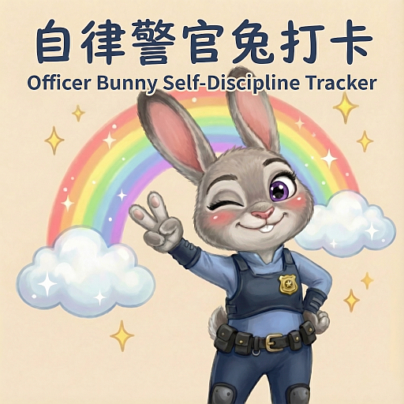
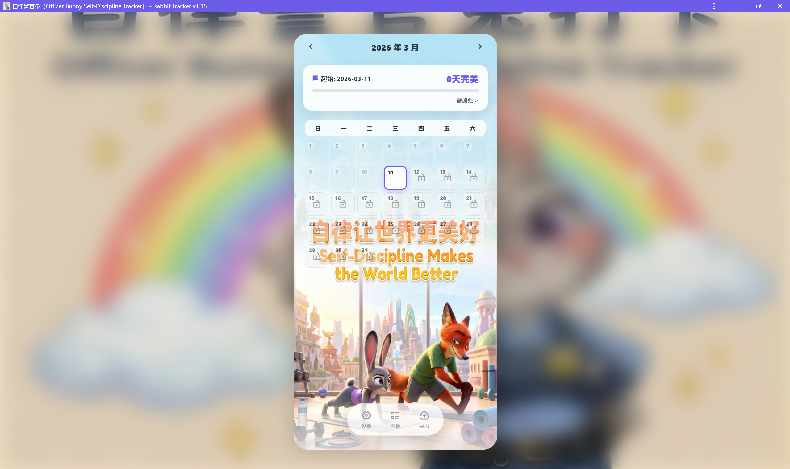
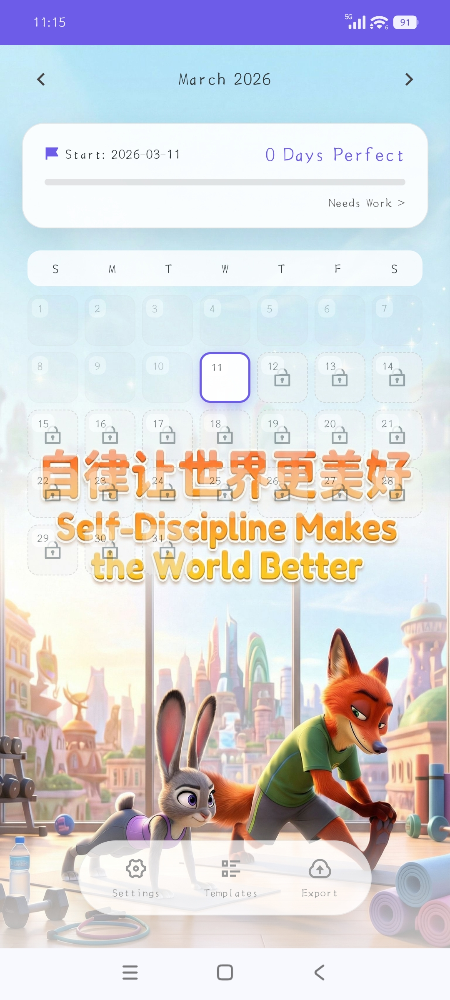

# 🐰 自律警官兔 / Officer Bunny Self-Discipline Tracker

<p align="center">
  
</p>

<p align="center">
  <a href="https://officerbunnytracker.netlify.app" target="_blank">
    
  </a>
  
  
  
  
</p>

<p align="center">
  <b>你的私人 Zootopia 自律训练系统</b><br>
  <b>Your Personal Zootopia Self-Discipline Training Academy</b>
</p>

> ⚠️ **关于视觉素材 / About Visual Assets** — 本项目展示的《疯狂动物城》风格视觉素材均为 AI 生成内容，未使用任何官方或网络原始素材。本项目定位为可完全自定义的工具框架，所有默认图片均可通过「设置」→「图片自定义」一键替换。用户可打造完全原创的个人自律系统。若 AI 生成内容与第三方权益存在潜在冲突，请联系删除。
>
> All Zootopia-style visuals in this project are AI-generated. No official or web-sourced assets are used. This project is a fully customizable tool framework — all default images can be replaced via Settings → Custom Images. Users can build a completely original self-discipline system. If AI-generated content potentially conflicts with third-party rights, please contact for removal.

---

## 📸 界面预览 / Screenshots

<p align="center">
  
  
</p>

🎬 [演示视频 / Demo Video](./docs/assets/officerbunnytracker-manual.webm)

---

## ✨ 核心亮点 / Key Features

### 📦 V1 基础功能 / V1 Core Features

#### 1. 🎮 沉浸式 Zootopia 游戏化 / Immersive Zootopia Gamification

##### 📊 当日打卡状态图（4阶段）/ Daily Check-in Status Image (4 Stages)

根据当日任务完成情况自动切换：

| 完成度 / Progress | 状态图 / Status Image |
|:---:|:---:|
| 0% | rabbit-tracker-sad (灰头土脸的朱迪 / Defeated Judy) |
| 1-49% | rabbit-tracker-heavy (背负重石的朱迪 / Struggling Judy) |
| 50-99% | rabbit-tracker-light (努力冲刺的朱迪 / Trying Hard Judy) |
| 100% | rabbit-tracker-happy (荣耀时刻的朱迪 / Victory Judy) |

##### 🗣️ 局长评语卡片 / Chief Bogo's Comment Card

根据**当月完成度**（完美天数 ÷ 已过去天数）触发：

| 当月完成度 (完美天数/已过去天数)<br>Monthly Completion (Perfect Days/Days Passed) | 局长评语 / Chief Bogo's Comment |
|:---:|:---|
| 0-50% | "听着，这个出勤率有点糟糕。别让甜甜圈耽误了任务！" / "Listen, this attendance is poor. Don't let donuts distract you from the mission!" |
| 51-99% | "表现很稳健，就像巡逻车一样可靠。再接再厉！" / "Steady performance, reliable as a patrol car. Keep it up!" |
| 100% | "难以置信的执行力！局里决定给你颁发'闪电侠'勋章！继续保持！" / "Unbelievable execution! The department is awarding you the "Flash" medal!" |

- 警情通报系统：点击顶部评价框触发疯狂动物城式反馈，强化正向激励 / Police Report System: Click top rating badge for Zootopia-flavored motivational feedback

#### 2. 🔒 隐私优先的本地优先架构 / Privacy-First, Local-First Architecture

- ✅ 纯前端实现，所有数据存储于 IndexedDB，无需注册/登录，零服务器依赖 / Pure frontend with IndexedDB storage — no registration, no login, zero server dependency
- ✅ Service Worker 离线缓存，断网环境下完整可用 / Service Worker offline caching — fully functional without network
- ✅ Chrome 无痕模式 Lighthouse 评分 100 分 / Chrome Incognito Lighthouse Score: 100/100

#### 3. 📅 灵活而严格的时间管理 / Flexible Yet Strict Time Management

| 功能 / Feature | 说明 / Description |
|:---|:---|
| 补卡机制 / Retroactive Check-in | 支持历史日期补录，但需二次确认，防止自我欺骗 / Backdating supported with double confirmation to prevent self-deception |
| 未来规划 / Future Planning | 可提前规划任务，但禁止提前打卡（防作弊设计）/ Plan ahead, but early check-in is blocked (anti-cheating design) |
| 完美日追踪 / Perfect Day Streak | 顶部进度条实时显示连续完美天数 / Real-time progress bar tracking consecutive perfect days |

#### 4. 🎨 深度个性化定制 / Deep Personalization

- 任务模板系统：预设常用任务，一键快速打卡 / Task Templates: Preset common tasks for one-tap check-in
- 全视觉自定义：可替换所有状态图片、背景壁纸、App 外壳背景 / Full Visual Customization: Replace all status images, wallpapers, and app backgrounds
- 双语支持：一键切换中英文界面 / Bilingual Support: One-click EN/CN switch

#### 5. 📊 数据主权与可移植性 / Data Sovereignty & Portability

- 一键导出 CSV 格式打卡数据，支持 Excel/Numbers 分析 / One-click CSV export for Excel/Numbers analysis
- 数据完全本地化，随时备份迁移 / Fully local data — backup and migrate anytime

#### 6. 🎨 零版权风险的完全自定义系统 / Zero Copyright Risk, Fully Customizable

- AI 生成默认素材：所有 Zootopia 风格图片均为 AI 原创生成，无盗图风险 / AI-Generated Default Assets: All Zootopia-style images are AI-original, zero infringement risk
- 100% 可替换架构：从状态图标到背景壁纸，每个像素都可由用户自定义 / 100% Replaceable Architecture: Every pixel from icons to wallpapers can be customized

---

### 🚀 V2 新增功能 / V2 New Features

V2 版本基于 **Vite 8** 完全重构，在保持 V1 所有功能的基础上，带来以下升级：

> **V2 亮点速览 / V2 at a glance**: 暗黑模式 · 月度曲线 · 徽章系统 · 分享卡片 · 性能翻倍

#### 🎨 暗黑模式与统一视觉 / Dark Mode & Unified Visuals
- 🌙 暗黑模式支持，桌面/移动端视觉统一
- 细腻的主题切换动画和过渡效果

#### 📈 月度完美曲线图表 / Monthly Perfect Curve (Chart.js)
- 使用 **Chart.js** 绘制月度完美天数趋势图
- 直观展示自律表现的起伏变化

#### 🛡 成长徽章系统 / Growth Badge System (4 Tiers)
- 4 档徽章等级：见习警员 → 正式警员 → 高级警员 → 传奇警长
- 支持自定义徽章图片裁剪，个性化展示
- 默认徽章图已优化为 **WebP** 格式，加载更轻量
- 使用 **Sharp** 进行服务端图片优化处理

#### 🧾 分享卡片导出 / Share Card Export
- 使用 **html2canvas** 生成精美分享卡片
- 卡片包含：局长评语 + 徽章 + 月度曲线 + 励志格言
- 一键保存图片，方便社交媒体分享

#### ⚡ 性能优化 / Performance Optimizations
- **Vite 8** 带来的构建速度提升
- Chart.js 与 html2canvas 延迟加载，首屏更轻更快
- Lighthouse 桌面/移动端双 100 分保持

---

---


## 🚀 快速开始 / Quick Start

### 在线体验 / Live Demo
👉 [officerbunnytracker.netlify.app](https://officerbunnytracker.netlify.app)

### 本地运行 / Local Development

> ⚠️ PWA 项目需要通过 HTTP/HTTPS 服务器运行（Service Worker 需要服务器环境）/
> ⚠️ PWA requires HTTP/HTTPS server (Service Worker needs server environment)

```bash
# 克隆仓库 / Clone repo
git clone https://github.com/Roleyking/officer-bunny-tracker.git

# 进入目录 / Enter directory
cd officer-bunny-tracker

# 安装依赖 / Install dependencies
npm install

# 开发模式 / Dev server
npm run dev

# 构建 + 预览 / Build + preview
npm run build
npm run preview

# 访问 / Visit
http://localhost:5173
```

### PWA 安装 / PWA Installation

1. 访问 [officerbunnytracker.netlify.app](https://officerbunnytracker.netlify.app) 或本地服务
2. 点击浏览器地址栏「安装」图标 / Click "Install" icon in browser toolbar
3. 添加到主屏幕，享受原生应用体验 / Add to home screen for native app experience

---

## 🛠 技术栈 / Tech Stack

| 技术 / Technology | 用途 / Purpose |
|:---|:---|
| Vue 3 + **Vite 8** | 前端框架 / Frontend framework |
| IndexedDB | 本地数据存储 / Local data storage |
| vite-plugin-pwa (Workbox) | 离线缓存 / Offline caching |
| **Chart.js** | 月度曲线图 / Monthly charts |
| **html2canvas** | 分享卡片导出 / Share card export |
| **Sharp** | 图片处理优化 / Image optimization |
| PWA | 渐进式 Web 应用 / Progressive Web App |

---

## 🎯 用户画像 / For Whom

| 标签 / Tag | 描述 / Description |
|:---|:---|
| 🎬 Zootopia 粉丝 / Zootopia Fans | 用熟悉的角色和语言，降低坚持门槛 / Familiar characters & language lower the barrier to consistency |
| 🔒 隐私重视者 / Privacy Seekers | 数据完全本地，不上传任何服务器 / Data stays local, zero server upload |
| 📈 自律追求者 / Self-Improvers | 需要强反馈机制来建立正向循环 / Strong feedback loops for habit building |
| 🎨 个性化爱好者 / Personalization Lovers | 希望打造独一无二的打卡系统 / Build a truly unique tracking system |

---

## 🗺 路线图 / Roadmap

- [x] 核心打卡功能 / Core check-in features
- [x] AI 生成视觉素材 / AI-generated visual assets
- [x] PWA 离线支持 / PWA offline support
- [x] 数据导出 CSV / CSV data export
- [x] 双语支持 / Bilingual support
- [x] 暗黑模式 / Dark mode
- [x] 月度完美曲线 / Monthly perfect curve (Chart.js)
- [x] 成长徽章系统 / Growth badge system (4 tiers)
- [x] 分享卡片导出 / Share card export
- [ ] AI 助手集成 / AI assistant integration
- [ ] 可选云同步（端到端加密）/ Optional cloud sync (E2E encrypted)

---

## 🤝 贡献 / Contributing

欢迎 Issue 和 PR！请确保：

1. 描述清晰的问题或功能建议 / Clear description of issue or feature
2. 保持代码风格一致 / Maintain consistent code style
3. 更新相关文档 / Update relevant documentation

---

## 📄 许可证 / License

本项目代码采用 MIT 协议开源。/ This project's code is open-sourced under the MIT license.

**素材声明**：默认视觉素材为 AI 生成，用户须自行承担替换后素材的版权责任。/ **Asset Notice**: Default visuals are AI-generated. Users bear full responsibility for copyright compliance of custom replacement assets.

---

## 💬 联系 / Contact

- 问题反馈 / Issues: [GitHub Issues](https://github.com/Roleyking/officer-bunny-tracker/issues)
- 邮件 / Email: billluo0114@gmail.com

---

<p align="center">
  <b>自律让世界更美好 / Self-Discipline Makes the World Better</b><br>
  <sub>🐰 Made with ❤️ by a vibecoding newbie</sub>
</p>
